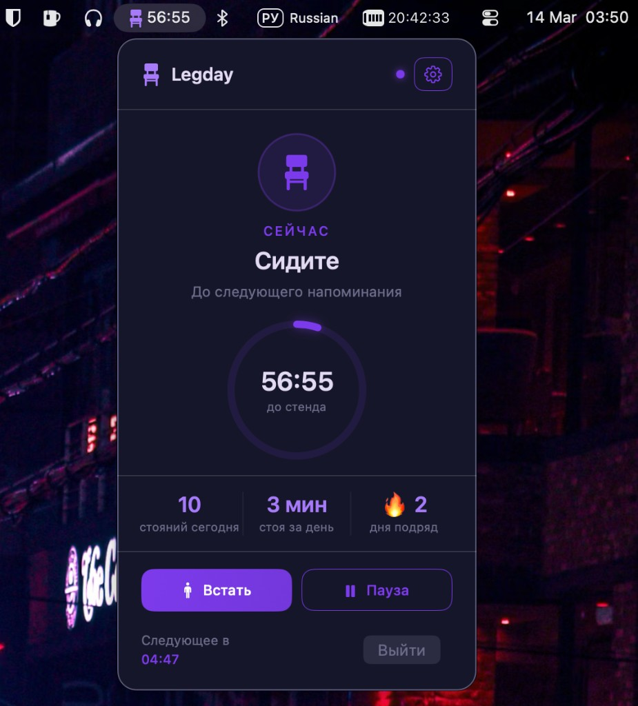
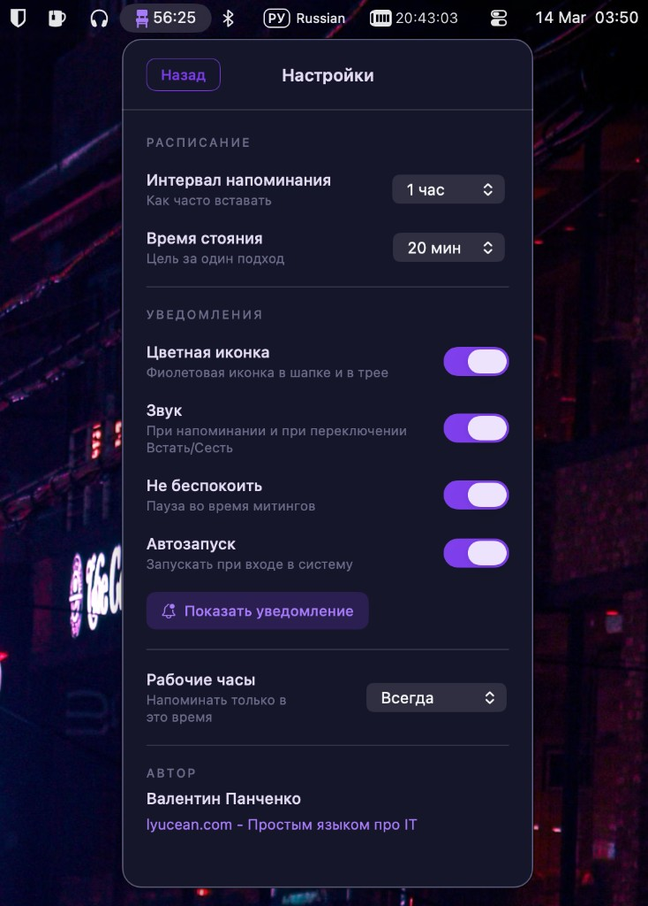
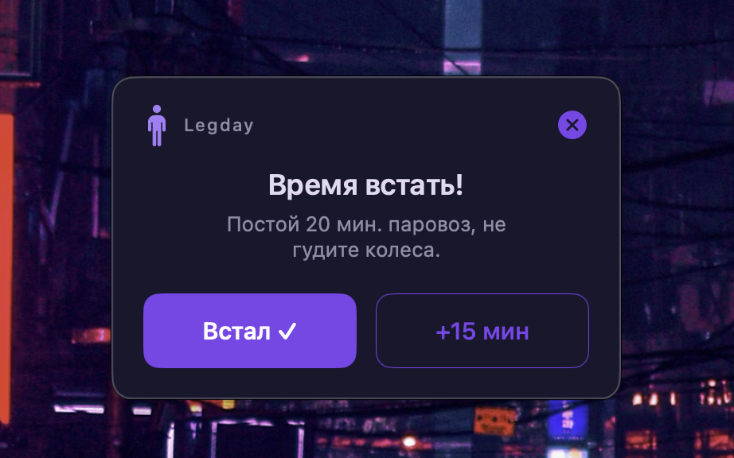

# Legday

Приложение для macOS, которое напоминает поработать стоя за столом. Помогает сохранять осанку и снижать нагрузку на спину при долгой работе за компьютером.

## Возможности

- **Напоминания** — уведомления по расписанию с предложением встать и постоять заданное время
- **Таймер в меню** — в трее отображается обратный отсчёт до следующего напоминания
- **Статистика** — количество стояний за день, время стояния и серия дней подряд
- **Настройки** — интервал напоминаний, длительность «стояния», рабочие часы, звук, автозапуск
- **Окно напоминания** — отдельное окно «Время встать!» с кнопками «Встал» и «+15 мин» (отложить)

## Скачать

Готовые сборки: **[Releases](https://github.com/lyucean/Legday/releases)**.

Скачайте файл **Legday-macOS-*.zip** (в блоке Assets релиза). Не путайте с «Source code (zip)» — там исходники проекта, а не приложение. В архиве только **Legday.app**. Распакуйте и перетащите Legday.app в «Программы».

**Если macOS пишет «не удалось проверить»:** приложение распространяется без подписи Apple Developer ID. Запуск: **правый клик по Legday.app → «Открыть»** (при первом запуске), затем «Открыть» в диалоге. Либо: «Системные настройки» → «Конфиденциальность и безопасность» → внизу разрешить Legday. Чтобы предупреждение не показывалось, нужна подпись и нотаризация через [Apple Developer Program](https://developer.apple.com/programs/) (платно).

## Требования

- macOS 15.0+
- Xcode 16+ (для сборки)

## Сборка

1. Откройте `Legday.xcodeproj` в Xcode
2. Выберите цель **Legday** и устройство **My Mac**
3. Соберите и запустите (⌘R)

## Скриншоты

### Главное окно

Текущий статус (сидите/стоите), обратный отсчёт до следующего напоминания, статистика за день и кнопки «Встать» и «Пауза».

### Настройки

Расписание (интервал напоминания, время стояния), уведомления (цветная иконка, звук, не беспокоить, автозапуск) и рабочие часы.

### Окно напоминания

Всплывающее окно в момент напоминания с кнопками «Встал» и «+15 мин».

## Лицензия

Legday
